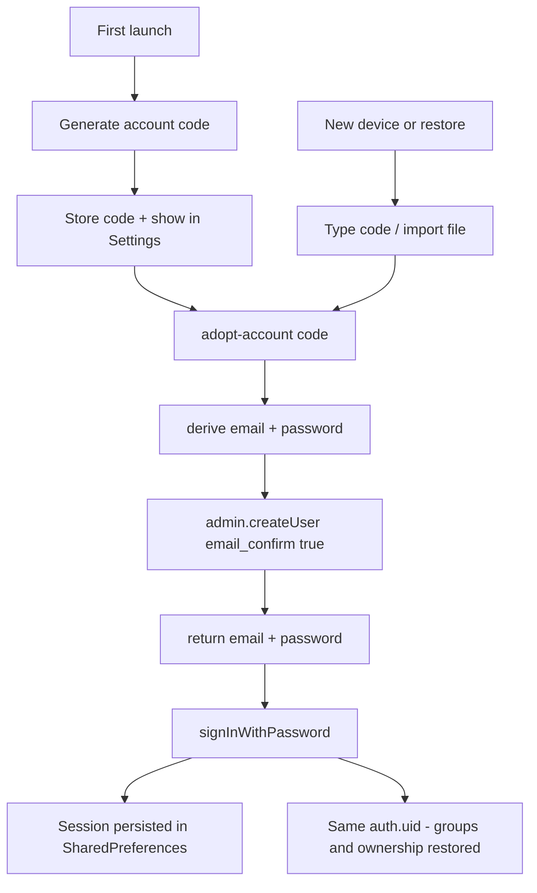

# Account-code identity (no email sign-in)

Replace the emailed one-time-code sign-in with a recoverable **account code**:
a short, human-typable secret that is the user's whole identity. The code is
generated on-device, shown in Settings, and written into a dedicated account
backup — not the shareable restaurant export — so a new device (or a restore)
can adopt the same account and bring its groups back.

## Why this shape

Every shared row is attributed by `created_by` / `user_id` = Supabase
`auth.uid()`, and every RLS policy is `to authenticated` keyed on that id
(`supabase/migrations/20260929000000_groups_schema.sql`). A "user identifier"
therefore has to resolve to a real Supabase identity — there is no way to key
groups on a purely local id without rewriting the whole backend.

Anonymous sign-in is already enabled, and the project's auth tokens are ES256
signed (a `kid` is present). Minting a session from an Edge Function would need
the private key, which is fragile. Instead, the code deterministically derives
**synthetic email + password**, and the app signs in with the standard password
grant. This yields genuine GoTrue sessions (multi-device, per-device refresh
tokens) with no email and no custom JWT.

## Security model

- The account code **is** the credential. Anyone who holds it can adopt the
  account. It is stored locally, shown once, and treated like a password.
- It is derived, not stored, server-side: two HMAC secrets (set as Edge
  Function secrets) turn the code into an email and a password, so no
  credential table exists and the secrets can be rotated by versioning.
- The synthetic address is undeliverable and `email_confirm: true` means no
  message is ever sent.
- Adoption is rate-limited per code and per client (a `private.account_attempts`
  table, the same pattern as `private.rate_attempts`) to resist brute force.
- The restaurant export is a *shareable* file (single restaurant, "share all",
  "export my data"). It must never carry the account code, or sharing a
  restaurant with a friend would hand them the whole account.
- The account code only ever leaves the app inside a dedicated, clearly-labelled
  account backup; importing one must offer an explicit, opt-in "adopt this
  account" step — never silent.

## Components

### 1. Edge Function `supabase/functions/adopt-account/index.ts`

Service-role function:

1. Validate and normalize the code format.
2. Rate limit via `record_account_attempt` / `private.account_attempts`.
3. Derive credentials:
   - `email = 'a' + base32url(HMAC-SHA256(code, SECRET_EMAIL)) + '@eatapp.invalid'`
   - `password = base32url(HMAC-SHA256(code, SECRET_PASSWORD))`
4. `admin.createUser({ email, password, email_confirm: true })`, ignoring the
   "already registered" error — deterministic credentials make re-adoption
   converge to the same user.
5. Return `{ email, password }`.

The client then calls `auth.signInWithPassword(email, password)` itself, so the
session (and its refresh token) stays entirely on the device.

### 2. Migration `supabase/migrations/<ts>_account_identity.sql`

- `private.account_attempts (kind text, code_hash text, attempted_at
  timestamptz)` + index, and a `record_account_attempt(text)` SECURITY DEFINER
  helper (mirrors `private.rate_attempts`).
- Extend `supabase/tests/rls_smoke_test.sql` so the new table is exercised and
  rolled back.

### 3. Client identity gateway `lib/data/supabase/identity.dart`

Replace `sendEmailCode` / `verifyEmailCode` with:

- `Future<Identity> createAccount()` — generate and store a code, adopt, sign in.
- `Future<Identity> signInWithCode(String code)` — adopt, sign in, store code.
- `String? accountCode()` — the stored code, for Settings and export.
- Keep `current()` and `signOut()`.

Keep the `SupabaseClient` built with `authFlowType: AuthFlowType.implicit`
(`lib/main.dart`): the password grant still runs gotrue's PKCE code-challenge
path, and this client has no async storage.

### 4. Account code `lib/data/supabase/account_code.dart`

- Secure-random generation and canonical grouping (`XXXX-XXXX-XXXX-XXXX`).
- Normalization/validation for entry.
- Entropy guidance: at least ~80 bits so a brute-force of the code is
  impractical given the rate limit.

### 5. Settings account section `lib/features/settings/settings_screen.dart`

- Signed out: show a "create my account" action; a "sign in with a code" field;
  the existing email field is removed.
- Signed in: show the account code (masked, copyable), sign out.

### 6. Restaurant export stays code-free `lib/data/share/restaurant_share_models.dart`

- The existing share/export format (`eatapp.restaurants.v3`, `v2`, and the
  whole-group `eatapp.group.v1`) is unchanged and carries **no** account data,
  so sharing a restaurant file remains safe.

### 7. Separate account backup `lib/data/share/account_backup.dart` (new)

- A distinct "Back up my data and account" action writes a dedicated file
  (`eatapp.account.v1`) bundling the restaurants plus the account code.
- Its UI copy marks the file non-shareable: anyone who has it can adopt the
  account.
- A matching reader accepts `eatapp.account.v1` alongside the share formats and
  surfaces an explicit, opt-in "adopt this account" step — never automatic.

## Flow

## Removal

- Rewrite `docs/sign-in.md` (drop the email-template and SMTP sections).
- Remove the email-template guidance, the `accountSendCode` / `accountVerify`
  l10n keys, and the email field.
