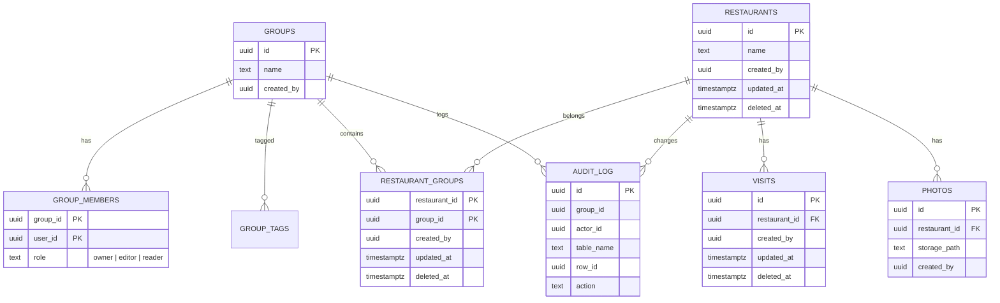
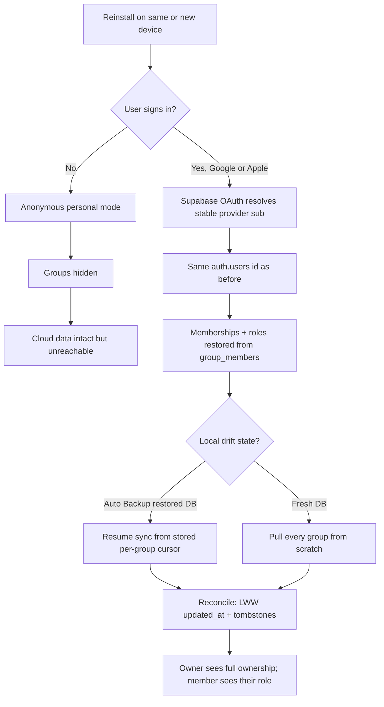

# Groups redesign — plan

Refactor EatApp so a restaurant can belong to one or more groups, redesign the
group model to be robust (roles, multiple membership, cloud sync, change
management), define the reinstall/recovery story, and re-specify export.

## Locked decisions

- **Identity**: social sign-in only (Google + Apple) via Supabase OAuth
  providers. Anonymous sign-in is removed as a group identity; a device that has
  never signed in stays in personal, offline mode.
- **Restaurant ↔ group**: a single canonical `restaurants` row shared across
  groups through a junction table (`restaurant_groups`). One source of truth,
  no per-group copies, no data drift.
- **Roles**: three — `owner`, `editor`, `reader`.
- **Group organisation**: flat groups with **tags** for organisation. A
  parent/child hierarchy is deferred (the visibility-inheritance cost in RLS is
  not justified by the current small friend/family use case).
- **Export**: the offline JSON export is kept and extended (it is the offline /
  portability path); cloud groups + sync remain the primary sharing mechanism.
  Export carries content, never cloud ownership.

## Target schema (Supabase)

### Key changes from the current schema

1. `restaurants` loses its single nullable `groupId`. Membership is the
   `restaurant_groups` junction; a private restaurant is one with zero junction
   rows.
2. `visits` / `photos` become canonical children of the restaurant. Their group
   visibility is inherited from the restaurant's memberships (a member of *any*
   group the restaurant is in can see them). Their denormalised `group_id`
   becomes the restaurant's **home group** (the group it was created in), used
   only for the Storage bucket folder `{home_group}/{photo_id}` and as an
   indexed RLS shortcut; the authoritative visibility check is the junction.
3. `group_members.role` widens from `owner|member` to `owner|editor|reader`.
   The existing `member` value is migrated to `editor` (member most closely
   means "can write").
4. New `group_tags(group_id, tag)` for organisation.
5. New `audit_log` for change management: who changed which row and when.

### Role permission matrix

| Action | owner | editor | reader |
| --- | --- | --- | --- |
| View restaurants / visits / photos | yes | yes | yes |
| Add / edit / delete restaurants | yes | yes | no |
| Log / edit / delete visits | yes | yes | no |
| Add / remove / edit photos | yes | yes | no |
| Rename group | yes | no | no |
| Dissolve group | yes | no | no |
| Add / remove members | yes | no | no |
| Change a member's role | yes | no | no |
| Mint invitations | yes | no | no |

### RLS summary

- Shared-data `select` policies: any member (`owner`, `editor`, `reader`).
- Shared-data `insert` / `update` / `delete`: `owner` + `editor` only
  (`is_group_editor` helper = owner or editor).
- `group_members`: `insert` owner-only (unchanged); add an `update` policy
  (owner-only) for role changes; `delete` owner-or-self (unchanged).
- `groups` update/delete: owner-only (unchanged).
- `restaurant_groups`: member-select, editor-insert/delete (with tombstones).
- New helper `is_group_editor`, keep `is_group_owner` / `is_group_member`.

## Reinstall / recovery flow (social sign-in)

Scenarios to define and cover in tests:

- **Owner reinstalls and signs in** with the same provider account → same
  `auth.users.id`, full ownership restored, all groups repopulated from cloud.
- **Member reinstalls and signs in** → membership + role restored, group data
  pulled.
- **Never signed in, or signs out** → personal mode only; no groups. Cloud data
  is untouched but hidden until the next sign-in.
- **Different provider account** → a new identity; the old account's groups are
  not merged (no cross-account merge without an explicit account link).
- **Reconciliation**: local rows (possibly restored by Auto Backup) are merged
  against the cloud by `updated_at` LWW; deletions are tombstones so they
  propagate. A restored-but-stale session is dropped and re-established by the
  OAuth sign-in.

## Export re-specification

- **Keep** the offline JSON export as the offline/portability path (no network,
  works when the cloud is unreachable).
- **Format**: extend `eatapp.restaurants.v2` → `eatapp.restaurants.v3` with an
  optional `memberships` array (group id + name per restaurant). Add a separate
  `eatapp.group.v1` format for whole-group export (restaurants + visits + group
  metadata: name, tags, members with roles).
- **What is exported**:
  - Individual restaurant: name, cuisine, address fields, price range, links,
    favourite flag, visits (date/rating/note/price). Photos stay excluded
    (size cap) unless the user opts in.
  - Whole group: the above for every restaurant, plus group name, tags, and the
    member roster with roles (as an informational snapshot).
- **Permissions / metadata**: roles and membership are exported as *snapshot
  metadata* only. They are not re-applied to the cloud; ownership and roles
  live in Supabase and cannot be transferred by a file. On import, the importer
  becomes the owner of the imported content.
- **Conflicts / ownership**: export is a point-in-time snapshot. Re-importing
  into a live group goes through the normal review screen (duplicate detection
  unchanged); cloud ownership is never altered by import.

## Phases

1. Supabase schema + RLS migration (roles, junction, tags, audit log) + smoke
   test.
2. Drift schema + migration (junction, tags, role enum) + regenerate.
3. Identity: replace anonymous with Google/Apple OAuth + account screen + sign-in
   gate.
4. Client group model + permissions (three roles, role management UI).
5. Restaurant ↔ multiple groups in the add/edit form.
6. Sync layer: multi-group push/pull, canonical-id dedupe.
7. Export v3 + group export format + import.
8. Reinstall/recovery reconciliation + tests.
9. L10n, README, analyze/test pass.
