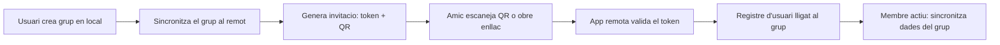

# Base de dades centralitzada per a grups compartits — EatApp

Anàlisi d'arquitectura per afegir grups compartits (amics/família) sobre la base
actual: app Flutter + drift (SQLite) 100% local, sense cap dependència de
xarxa, amb un esquema de `restaurants` / `visits` / `photos` amb IDs UUID
generats al client (`lib/data/db/tables.dart`).

---

## 0. Punt de partida: el que ja tenim a favor

El projecte actual té tres propietats que faciliten molt la migració a un
model sincronitzat:

1. **IDs UUID generats al client** (`id` és `text()` amb UUID del
   repositori, no autoincrement). Això és la peça clau per a sincronització
   multi-escriptor: cap col·lisió d'IDs entre dispositius i cap dependència
   d'un servidor que assigni claus.
2. **Esquema ja "multi-usuari friendly"**: les dades són per restaurant/visita,
   no per usuari; afegir una columna `groupId` + `createdBy`/`updatedAt` és una
   migració additiva.
3. **Cap xarxa avui** — qualsevol solució introduirà la primera dependència de
   xarxa del projecte, cosa que `AGENTS.md` marca explícitament com a decisió a
   discutir (aquest document és precisament aquesta discussió).

---

## 1. Arquitectura de creació i incorporació de grups

### Flux proposat



### Mecanismes d'invitació — avaluació

| Mecanisme | Viabilitat | Seguretat | Notes |
|---|---|---|---|
| **Codi QR** | Alta — `qr_flutter` per generar, `mobile_scanner` per llegir | Alta si el QR codifica un token d'un sol ús o de curta vida | El millor UX presencial: tots dos al mateix sopar, un mostra el QR. Incorporem el token + URL profunda (`eatapp://join/<token>` o `https://eatapp.app/j/<token>` amb App Links/Universal Links) |
| **Enllaç profund** | Alta | Mitjana-alta: el token viatja per canals de missatgeria (WhatsApp), pot reenviar-se | Complement natural del QR: mateix token, format diferent. Cal expiració i límit d'usos |
| **Codi alfanumèric curt** (p. ex. `K7F2-QM9X`) | Alta | La més baixa: espai petit, susceptible a endevinar | Útil com a fallback per a gent gran o quan el QR falla. Amb 8+ caràcters d'un alfabet sense ambigüitats i rate-limit al servidor, acceptable |
| **Aprovació pel creador** | — | Molt alta | Combinable amb qualsevol dels anteriors: la invitació crea una *petició pendent* i el creador l'accepta |

### Recomanació d'alta

- **Token d'invitació** aleatori de 128 bits (base32 sense caràcters
  ambigus), emmagatzemat al remot amb: `groupId`, `expiresAt` (p. ex. 7 dies),
  `maxUses` (opcional), `usesCount`, `createdBy`.
- El QR codifica l'enllaç profund amb el token; el codi alfanumèric és la
  representació tipada del mateix token (o d'un segon token curt amb
  rate-limit estricte).
- **Registre d'usuari mínim**: nom a mostrar + identitat del dispositiu. No cal
  email si el proveïdor ho permet (PocketBase ho permet amb comptes
  "username-only"; Supabase/Firebase exigeixen email o sign-in anònim).
- **Model de pertinença**: taula `group_members` (`groupId`, `userId`, `role`:
  `owner`/`member`, `joinedAt`). El procés d'alta és: validar token → crear
  compte → inserir `group_members` → primera sincronització del grup.
- **Revocació**: el creador pot regenerar o esborrar el token en qualsevol
  moment; les invitacions expirades moren sol·les.

### Seguretat del procés

- El token és un *secret portador*: qui el té, entra. Mitigacions: expiració
  curta, límit d'usos, i opció "requerir aprovació del creador" per a grups on
  això importi.
- Cap dada del grup no viatja dins del token — només l'adreça per demanar
  l'entrada. Les dades només flueixen un cop el membre existeix a
  `group_members` i les regles RLS del servidor ho verifiquen.

---

## 2. Pertinença múltiple (un usuari a diversos grups)

### Model de dades

És tècnicament senzill i **recomanat des del primer dia** (migrar-ho després és
molt més car):

```text
users        (id, display_name, ...)          — remot
groups       (id, name, created_by, created_at)
group_members(id, group_id, user_id, role, joined_at)   — PK (group_id, user_id)
restaurants  (..., group_id NULL = privat, created_by, updated_at, deleted_at)
visits       (..., created_by, updated_at, deleted_at)
photos       (..., updated_at, deleted_at)
```

- `group_id NULL` als restaurants locals existents = dades **privades**
  (compatibilitat perfecta amb les instal·lacions actuals i amb la importació
  Room→drift, que no cal tocar).
- Un restaurant pertany a **un** grup (o a cap). No es comparteix entre grups:
  duplicar-lo és explícit i barat, compartir-lo amb referència creuada és
  complex i innecessari a aquesta escala.

### Gestió d'identitats

- **Identitat local primer**: l'app ja té dades sense cap compte. En activar
  grups, es crea una identitat (`userId` UUID local + credencial al remot).
  Aquesta identitat és única i és la mateixa a tots els grups — no una per grup.
- El vincle local↔remot es guarda a `shared_preferences` (token de sessió +
  `userId`).
- Sense email obligatori és possible (PocketBase), però un email opcional
  permet recuperar el compte canviant de telèfon — decisió de producte, no
  tècnica.

### Interfície d'usuari

- **Selector de grup** a la llista (chip/filtre superior o pestanya al shell):
  "Personal", "Família", "Amics del poble"…
- El mode "Personal" és exactament l'app d'avui: zero canvis de comportament
  per a qui no usi grups.
- La ruleta, les estadístiques i el widget operen sobre el grup seleccionat
  (el widget continua llegint la preferència publicada per Dart, mateix
  contracte d'`HomeWidgetKeys`).
- La navegació de dues columnes (`HomeShell`) no canvia: el selector viu a la
  llista, no al shell.

### Implicacions tècniques

- Totes les consultes dels DAOs necessiten el filtre `groupId` (o `IS NULL`
  per al mode personal). Amb drift, un mètode parametritzat al DAO ho cobreix.
- Les estadístiques agregades per grup són independents — bona notícia: cap
  mescla accidental de dades.
- Les fotos: fitxers locals per restaurant; en mode grup, el binari també s'ha
  de sincronitzar (vegeu §3).

---

## 3. Model de dades compartides: local, remot o híbrid?

### Les tres opcions

| Model | Descripció | Veredicte |
|---|---|---|
| **Només remot** | L'app passa a ser client d'una API; sense xarxa no funciona | **Descartat**: trencaria la promesa actual de l'app (funciona offline, dades pròpies) i el flux d'importació Room→drift |
| **Només local + exportació** | L'estat actual (fitxers compartits a mà) | No compleix l'objectiu de sincronització contínua |
| **Híbrid: local és la font, remot és el llogaret** | El drift local continua sent la font de veritat; un servei de sincronització empenta/tira canvis cap al remot quan hi ha xarxa | **Recomanat** |

### Detall del model híbrid

- Cada taula compartida guanya metadades de sincronització:
  `updated_at` (epoch millis, rellotge del dispositiu que escriu),
  `deleted_at` (esborrat suau — mai esborrat dur en taules compartides),
  `created_by`, i una cua de canvis pendents (`pending_ops` o marcatge
  `dirty`).
- **Push**: en recuperar connectivitat (o en cada escriptura amb xarxa), la
  cua s'envia al remot amb upserts idempotents per `id`.
- **Pull**: el client demana "tot el que ha canviat al meu grup des del meu
  últim `last_pulled_at`" i fa upsert local. Cada dispositiu guarda el seu
  propi cursor.
- **Fotos**: el binari no va a la fila SQLite; la fila guarda la referència i
  el servei de sincronització pujada/baixa el fitxer a un bucket (Supabase
  Storage / PocketBase files). Caché local: el fitxer es baixa sota demanda i
  es manté a `filesDir/photos/` com avui.

### Conflictes de sincronització

On hi ha conflictes reals i com resoldre'ls:

- **Última escriptura guanya (LWW) per camp o per fila**, amb `updated_at`
  com a àrbitre: suficient i molt més senzill que CRDT per a aquest domini.
- **Casos típics**:
  - Dos membres editen la nota d'una visita → guanya el `updated_at` més
    nou. Acceptable: són notes personals sobre un sopar compartit.
  - Dos membres creen "el mateix" restaurant (duplicat) → **no es fusiona
    automàticament**; el mateix mecanisme de detecció de duplicats que ja té
    la importació (`test/data/share/duplicate_detection_test.dart`) pot
    avisar en pantalla. Millor explícit que màgia.
  - Un membre edita mentre un altre esborra el restaurant → l'esborrat suau
    guanya si és posterior; l'edició perduda queda a la fila (soft-deleted)
    i es pot ignorar.
- **Coherència**: el model és *eventualment coherent*; la UI no ha de prometre
  temps reals. Un refresc amb "última sincronització fa X" a la pantalla de
  grup gestiona l'expectativa.
- **Rellotges**: els `updated_at` de dispositius diferents no són comparables
  al mil·lisegon; per desempatar exacte cal un `device_id` secundari i, si el
  servidor assigna `server_updated_at` en arribar, aquest és l'àrbitre final
  per al pull.

### Sense connexió

Tot continua funcionant en local (és el comportament actual). En tornar la
xarxa, la cua pendent s'envia. Els límits: si un membre desconnectat esborra
una cosa que un altre ha editat mentrestant, s'aplica LWW; si dos creen el
mateix restaurant, apareixen dos files fins que algú fusioni/esborri a mà.

---

## 4. Gestió multi-tenant

### Alternatives comparades

| Opció | Descripció | Cost operatiu | Aïllament | Idoneïtat per a projecte petit |
|---|---|---|---|---|
| **Una BD, partició lògica** (`group_id` a cada fila + RLS/RLP) | Totes les files d'un grup porten `group_id`; les regles del servidor filtren | Mínim | Bo si RLS està ben configurat | ★★★ **Recomanada** |
| **Una BD per grup** | Cada grup és una BD/esquema físic separat | Alt (creació, migracions × N grups, còpies) | Màxim | ★ — desproporcionat |
| **Esquemes independents** (schema-per-group, PostgreSQL) | Un schema PG per grup | Mitjà-alt: migracions per schema, connexions, cerques cross-schema | Alt | ★★ — innecessari a aquesta escala |

### Recomanació: partició lògica amb Row Level Security

- Una única base de dades Postgres (Supabase) o una única col·lecció de
  taules (PocketBase) amb `group_id` a cada fila compartida.
- **L'aïllament no es confia al client**: es fa al servidor.
  - Supabase: RLS per taula — `group_id IN (SELECT group_id FROM group_members WHERE user_id = auth.uid())`.
  - PocketBase: collection rules equivalents (`@request.auth.id != "" &&
    group_members.user_id ?= @request.auth.id`).
- Un únic esquema significa **una sola migració**, un sol backup, i consultes
  d'administració trivials. Per a grups de famílies i amics (desenes de grups,
  no milions), el teòric "soroll" de tenir-ho tot plegat és irrellevant.
- La partició física per grup només té sentit si cada grup necessita
  garanties de compliment (GDPR per client) o volum propi — no és el cas.

---

## 5. Anàlisi de riscos

| # | Risc | Impacte | Mitigació |
|---|---|---|---|
| 1 | **Accés entre grups** (un membre llegeix dades d'un altre grup) | Alt | RLS al servidor verificat amb tests; el client mai filtra "confiant". Auditoria: cada consulta passa per la regla de `group_members` |
| 2 | **Token d'invitació filtrat** (reenviat per WhatsApp a un desconegut) | Mitjà | Expiració curta, límit d'usos, opció d'aprovació pel creador, regeneració del token |
| 3 | **El creador veu notes privades dels membres?** | Mitjà (privacitat dins del grup) | Decisió de producte explícita: tot el que està al grup és visible per al grup; les dades `group_id NULL` mai surten del dispositiu. Comunicar-ho a la pantalla de creació del grup |
| 4 | **Conflictes d'edició concurrent** | Baix-mitjà | LWW amb `updated_at` + esborrat suau; sense fusió automàtica de duplicats; detecció de duplicats ja existent per avisar |
| 5 | **Eliminació de membres** | Mitjà | El membre surt: les seves files creades **romanen** al grup (història compartida) amb `created_by` preservat; només perd l'accés. El creador pot expulsar; un membre pot marxar |
| 6 | **Dissolució del grup** | Mitjà | Opcions: (a) el grup esborrat fa que cada membre conservi una còpia local de les dades (ja les té: el model híbrid les deixa al drift local); (b) transferència d'ownership. El model local-first fa aquest risc molt suau: ningú perd les dades que veia |
| 7 | **Recuperació de dades / backup** | Mitjà | Supabase: backups al pla Pro (de pagament); PocketBase: un fitxer SQLite copiable — trivial de fer backup. A més, l'app ja té exportació pròpia (`data/share/backup_writer.dart`) com a xarxa de seguretat del costat client |
| 8 | **Límits del pla gratuït** | Mitjà | Vegeu comparativa a §6: Supabase free pausa projectes inactius als ~7 dies; Firebase free és generós però els writes/lectures creixen amb l'ús; PocketBase autoallotjat no té límits però requereix un servidor (un VPS de ~4 €/mes o un servei PaaS gratuït petit) |
| 9 | **Dependència del proveïdor (lock-in)** | Mitjà | El client guarda tot en drift local: el pitjor cas és "el servei mor i l'app torna a ser offline-only", no "perd les dades". El protocol de sincronització (upsert per UUID + pull incremental) és portable a qualsevol backend |
| 10 | **Abus del backend obert** (algú escriu directament a l'API) | Mitjà | Totes les regles d'accés al servidor; validació de mida/camps també al remot; el format `eatapp.restaurants.v2` ja valida camp a camp — replicar la validació a les regles del servidor |
| 11 | **Fotos: cost d'emmagatzematge** | Mitjà | Compressió ja existent (`image` normalitza i limita el costat més llarg); quota de fotos per membre; baixada sota demanda |
| 12 | **schemaVersion 14/15 i migracions** | Baix | Les noves columnes (`group_id`, `updated_at`, `deleted_at`, `created_by`) són una migració drift additiva 15→16; cal escriure-la de veritat (`onUpgrade` actual llança `UnsupportedError`) |
| 13 | **Privacitat legal (GDPR)** | Baix a aquesta escala | Dades mínimes (nom a mostrar), cap analítica, cap tracking — coherent amb la política actual del projecte |

---

## 6. Recomanació final

### Comparativa de proveïdors

| Criteri | **Supabase** | **Firebase (Firestore)** | **PocketBase** | CouchDB/Couchbase Lite |
|---|---|---|---|---|
| Pla gratuït suficient | Sí (500 MB BD, 1 GB storage, 2 projectes) — **però pausa projectes inactius ~1 setmana** | Sí, molt generós (Sparkplan: 1 GB storage, 50k lectures/dia) | Illimitat si autoallotges (cost del VPS) | Illimitat autoallotjat, complex |
| Sincronització offline nativa | No nativa — cal construir-la (o `powersync`/`drift` + supabase, paquet de pagament per PowerSync) | **Sí** (Firestore offline persistence és automàtica) | No nativa — cal construir-la (igual que Supabase, però protocol propi més senzill) | **Sí**, nativa i madura, però SDK Dart marginal i model molt idiosincràtic |
| RLS / permisos per grup | **Excel·lent** (Postgres RLS, el cas d'ús exacte de §4) | Regles de Firestore: potents però amb sintaxi pròpia i fàcil d'equívoc | Regles per col·lecció: senzilles i suficients | Mapes de rols per BD |
| Integració amb drift local | Mitjana: cal escriure la capa de sync (push/pull per UUID) | Baixa: Firestore no és SQL; duplicaria el model (drift local + Firestore remot) i caldria mantenir dues representacions | Mitjana: mateixa situació que Supabase, amb API més petita | Baixa: substituïria drift, trencaria l'import Room→drift |
| Manteniment per a projecte petit | Baix (servit) | Baix (servit) | Baix-mitjà (un binari Go, un fitxer SQLite; tu el puges) | Alt |
| Cost a escala del projecte | 0 € durant molt de temps; Pro 25 €/mes només si creix | 0 € durant molt de temps | 0 € + ~4 €/mes de VPS si es vol sempre en línia | 0 € + infraestructura |
| Risc de lock-in | Baix (Postgres estàndard; exportable) | Alt (format propietari, exportació incòmoda) | Molt baix (SQLite + API oberta) | Baix |

### Decisió: **Supabase + capa de sincronització pròpia sobre drift**

Decidit amb l'usuari: el projecte anirà per Supabase. La resta d'aquesta
secció queda com a registre de l'avaluació; el plànol d'implementació del final
del document és el pla executiu.

Per què:

1. **Encaixa amb el model de dades actual**: Postgres relacional ↔ drift/SQLite
   és una correspondència gairebé 1:1 (`restaurants`, `visits`, `photos` amb
   els mateixos camps + metadades de sync). Firestore obligaria a mantenir dos
   models mentals diferents.
2. **RLS de Postgres és exactament la solució del §4**: una regla per taula que
   comprovi la pertinença al grup, verificable amb tests SQL.
3. **Pla gratuït real** per a l'escala inicial (grups d'amics/família: desenes
   d'usuaris, milers de files). La pausa per inactivitat es mitiga: l'app és
   d'ús freqüent i, en el pitjor cas, el projecte es restaura des del tauler
   en un minut (les dades dels usuaris mai es perden amb la pausa).
4. **El treball de sync és assumible** perquè la base ja està preparada: UUIDs
   del client, upsert idempotent, pull incremental per `updated_at`. És el
   mateix protocol que ja fa servir la compartició per fitxers
   (`data/share/`), generalitzat.
5. **Sortida d'emergència**: tot viu també al drift local; si Supabase
   desapareix, l'app torna al mode actual sense pèrdua.

Detalls específics de Supabase per a la implementació:

- **Paquet Dart**: `supabase_flutter` (client + auth + storage + realtime).
  S'instancia un únic client a `main()` i es publica a l'arbre via
  `AppScope` junt amb els repositoris existents — sense DI nou.
- **Auth**: `signInAnonymously()` per defecte (zero fricció, coherent amb
  "cap email obligatori"), amb opció de vincular un email després
  (`updateUser`) per poder recuperar el compte en canviar de telèfon. La
  sessió es guarda a `shared_preferences` com la resta de preferències.
- **Realtime (opcional, fase posterior)**: subscripció als canvis de les
  taules del grup per refrescar la UI en viu. No és requisit — el pull
  incremental periòdic n'és suficient per començar, i evitar-lo redueix
  superfície i consum de quota.
- **Invitacions**: la validació del token (hash, expiració, límit d'usos,
  rate-limit) ha de fer-se al servidor, no en regles RLS. Una **Edge
  Function** (`join-group`) és el lloc natural: rep el token + crea el compte
  + insereix a `group_members` de manera atòmica. El token es guarda com a
  hash (SHA-256), mai en clar.
- **Storage**: un bucket privat `photos` amb path `{group_id}/{photo_id}`;
  les regles de Storage comproven la pertinença al grup igual que RLS.
  Baixada sota demanda amb caché local a `filesDir/photos/`.
- **Migracions del remot**: fitxers SQL versionats al repo (`supabase/`
  migrations o SQL aplicat amb la CLI) — l'esquema remot ha de ser
  reproduïble, no "configurat a mà al tauler".
- **Tests**: la capa de sync es testeja amb un fake del client Supabase
  (fets a mà, sense mocking package, com la resta del projecte); les
  polítiques RLS es verifiquen amb SQL directe quan sigui possible.

Esquema remot mínim (una BD, partició lògica, RLS a tot):

```sql
-- Supabase ja gestiona els usuaris a auth.users (signInAnonymously crea una
-- fila allà). No es duplica cap taula users: només cal un perfil per al nom.
profiles      (id uuid pk references auth.users, display_name, created_at)
groups        (id uuid pk, name, created_by uuid -> auth.users, created_at)
group_members (group_id, user_id -> auth.users, role, joined_at,
               pk (group_id, user_id))
invites       (id uuid pk, group_id, token_hash, expires_at, max_uses, uses_count)
restaurants   (id uuid pk, group_id not null, ..., created_by, updated_at, deleted_at)
visits        (id uuid pk, group_id not null, ..., created_by, updated_at, deleted_at)
photos        (id uuid pk, group_id not null, ..., storage_path, updated_at, deleted_at)
-- RLS tipus, a cada taula compartida:
-- using (group_id in (select group_id from group_members where user_id = auth.uid()))
```

Decisions fixades per la revisió del pla:

- **Cap taula `users` pròpia**: la identitat viu a `auth.users` de Supabase
  (el `signInAnonymously()` ja hi crea la fila); `profiles` només afegeix el
  nom a mostrar. Totes les RLS fan servir `auth.uid()` — duplicar usuaris
  seria una font de desincronització.
- **`group_id NOT NULL` al remot**: les dades privades (`group_id NULL` al
  drift local) mai surten del dispositiu. Si el remot acceptés NULL, una RLS
  mal configurada podria exposar-les; no acceptar-les és la defensa.
- **El pull inclou tombstones**: la consulta incremental per `updated_at`
  retorna també les files amb `deleted_at` no nul, perquè els esborrats es
  propaguin a tots els membres.
- **Enllaç profund**: fase 1 amb esquema personalitzat
  `eatapp://join/<token>` (intent-filter simple); App Links amb domini
  verificat i Universal Links són enduriment de fase posterior.
- **`searchText` no es sincronitza**: és una columna derivada que cada client
  reconstrueix amb `buildSearchText`; sincronitzar-la només convida a
  divergència.
- **Ordre de pujada de fotos**: el binari va a Storage *abans* d'insistir la
  fila `photos` al remot, i la fila porta `storage_path`; així cap referència
  penjora mai.
- **`visits` i `photos` duen `group_id` desnormalitzat** (còpia del del seu
  restaurant): és el que permet que les RLS siguin una sola comparació
  indexada en lloc d'un join per fila.

### Alternativa recomanada: **PocketBase autoallotjat**

Si es prefereix **zero dependència d'un SaaS** i es té on allotjar-lo (un VPS
petit): un sol binari amb SQLite, auth amb usuaris sense email, fitxers
inclosos, regles per col·lecció, backup = copiar un fitxer. La capa de sync a
l'app és la mateixa que per Supabase (el protocol és del client, no del
proveïdor). Ideal si el projecte valora sobirania de dades per sobre de la
comoditat del servei gestionat.

### I Turso?

Turso (libSQL — un fork de SQLite — com a servei) mereix consideració separada
perquè comparteix dialecte amb el drift local del projecte:

| Criteri | Avaluació |
|---|---|
| Pla gratuït | Molt generós: 500 bases de dades, ~5 GB, lectures/escriptures diàries àmplies — de sobres per a l'escala inicial |
| Encaix amb drift | **El millor de tots**: mateix dialecte SQL, mateixos tipus; el mapeig esquema local↔remot és trivial i hi ha SDK Dart oficial (`libsql_dart`) amb adaptador per a drift |
| Sincronització offline | **Cap de nativa avui**: les *embedded replicas* de libSQL (rèplica local que es sincronitza) han estat retirades de la plataforma Turso, així que caldria la mateixa capa de sync pròpia que amb Supabase |
| Control d'accés | **El punt feble**: SQLite no té RLS. Turso autentica *tokens de base de dades*, no usuaris — qualsevol que tingui el token d'una BD hi té accés complet. No hi ha usuaris, rols ni permisos per fila |
| Multi-tenant | L'única manera segura és **una BD per grup** (el pla gratuït ho permet: 500 BD) amb un token per grup. Però crear BDs, emetre tokens i gestionar pertinença exigeix un **backend propi** (un petit servei que guardi el token de plataforma de Turso), perquè el client mai no pot tenir les credencials de plataforma |
| Fitxers (fotos) | No té object storage; caldria un servei al costat (o blobs a SQLite, poc recomanable per a fotos) |
| Manteniment | Baix si es fa servir com a BD remota simple; mitjà si cal el backend de gestió de grups |
| Lock-in | Baix: libSQL és SQLite; es pot migrar a qualsevol SQLite/Postgres |

**Veredicte**: Turso és una opció *viable* però incompleta per a aquest cas
d'ús. El seu punt fort — el dialecte SQLite compartit amb drift — encerta de
ple, i una BD-per-grup encaixa conceptualment amb la partició per grup. Però
sense RLS ni usuaris, tota la lògica de "qui pot veure quin grup" (§1, §4, §5)
hauria de viure en un backend propi que Turso no aporta, i les fotos necessiten
un segon servei. És a dir: Turso resol l'*emmagatzematge* però no la *plataforma*
— amb Supabase o PocketBase, les regles d'accés i els fitxers venen inclosos.

Quan tindria sentit triar Turso: si més endavant es decideix construir un
backend propi petit (per exemple per raons de sobirania de dades), Turso és el
magatzem natural d'aquell backend, i el costat client no canvia (mateixa capa
de sync pròpia sobre drift).

### Descartades, amb motiu

- **Firebase/Firestore**: la millor sync offline del mercat, però el model
  documental no encaixa amb el relacional del projecte i duplicaria la
  lògica de dades; el lock-in és real.
- **CouchDB/Couchbase Lite**: la sync offline més madura, però obligaria a
  substituir drift (trencant la importació Room→drift i tota la capa de dades)
  i l'ecosistema Dart és feble.

### Estat de la fase 1 (implementada i verificada)

La fase 1 (projecte Supabase + esquema remot + invitacions) està **completa
i verificada contra el projecte real**. Tot el codi del remot viu al repo
sota `supabase/`:

- **Migracions** (`supabase/migrations/`, aplicades amb `supabase db push`):
  - `20260927100000_groups_initial_schema.sql` — taules (`profiles`,
    `groups`, `group_members`, `invites`, `restaurants`, `visits`, `photos`),
    bucket privat `photos` amb regles de Storage, trigger `updated_at`.
  - `20260927101000_join_rate_limit.sql` — taula `private.join_attempts` i
    RPC `record_join_attempt()` (10 intents / 10 minuts per usuari).
  - `20260927102000_fix_rls_recursion.sql` — helpers `is_group_member()` /
    `is_group_owner()` SECURITY DEFINER i totes les polítiques reescrites.
  - `20260927103000_grant_client_roles.sql` — grants per a `anon`/`authenticated`.
  - `20260927104000_group_creator_membership.sql` i
    `20260927105000_group_creator_helper.sql` — bootstrap del creador.
  - `20260927106000_grant_service_role.sql` — grants per a `service_role`.
- **Edge Functions** (`supabase/functions/`, desplegades):
  - `join-group` — valida el token (hash SHA-256, expiració, usos), fa el
    rate-limit, insereix la pertinença amb service role i sincronitza el nom.
  - `create-invite` — només per a owners; genera un token de 128 bits en
    alfabet base32 sense ambigüitats, en guarda el hash i retorna el token
    cru una única vegada.
- **Tests** (`supabase/tests/`):
  - `rls_smoke_test.sql` — simula dues sessions (Alice/Bob) amb
    `set_config('request.jwt.claims')` i verifica aïllament complet.
  - `join_group_e2e_test.ps1` — flux real contra l'API: dos usuaris anònims,
    grup, invitació, join, lectura RLS i rebuig de token fals. **Passat.**
  - `cleanup_test_data.sql` — neteja les dades de prova.

**Bugs reals que el test va destapar i que estan corregits** (raó per la qual
el smoke test es va escriure abans de donar la fase per bona):

1. **Recursió infinita a RLS**: la política de `group_members` es consultava
   a si mateixa. Fix estàndard: helpers `SECURITY DEFINER`
   (`is_group_member`/`is_group_owner`) que trenquen la recursió.
2. **Ou-i-gallina del creador**: el creador no podia inserir la seva pròpia
   fila d'owner (la política exigia ser owner per insertar). Fix: el creador
   del grup pot autoinscriure's com a owner (`is_group_creator`).
3. **Cerca d'invitació filtrada per RLS**: `join-group` consultava `invites`
   amb les credencials del cridant, que encara no és membre — 404 sempre.
   Fix: la cerca del hash es fa amb el client service-role (no filtra res:
   compara un hash opac).
4. **Grants absents**: les taules creades per migració no hereten els default
   privileges del tauler; calien grants explícits per a `anon`,
   `authenticated` i `service_role` (RLS bypass no implica privilegis de
   taula).
5. **Anonymous sign-ins deshabilitats** al projecte: activats via l'API de
   gestió (`external_anonymous_users_enabled: true`).

Configuració del projecte: `supabase link` ja fet (`.temp/` ignorat per git);
l'app Flutter llegirà URL i clau anon via `--dart-define`, mai hardcodejades.

### Plànol d'implementació amb Supabase (fases)

1. **Projecte Supabase + esquema remot**: crear el projecte, migracions SQL
   versionades al repo (taules `users`/`groups`/`group_members`/`invites` +
   metadades de sync a les taules compartides), polítiques RLS a tot, bucket
   privat `photos`, i l'Edge Function `join-group` per validar invitacions.
2. **Migració drift 15→16**: afegir `group_id`, `created_by`, `updated_at`,
   `deleted_at` a les taules compartides; `group_id NULL` = dades privades;
   regenerar amb build_runner; tests de DAO amb el filtre de grup.
3. **Identitat i client Supabase** (`lib/data/supabase/`): `supabase_flutter`
   instanciat a `main()` i publicat via `AppScope`; `signInAnonymously()` amb
   vinculación d'email opcional; sessió a `shared_preferences`.
4. **Capa de sincronització** (`lib/data/sync/`): cua de canvis pendents,
   push/pull incremental per `updated_at`, gestió de fotos amb Storage,
   indicador d'estat a la UI; fakes a mà per als tests.
5. **Grups i UI** (`lib/features/groups/`): creació de grup, selector de grup
   a la llista, pantalla de membres (expulsió/marxar), totes les cadenes als
   tres fitxers ARB.
6. **Invitacions**: QR (`qr_flutter` + `mobile_scanner`), enllaç profund
   (`eatapp://join/<token>` + App Links/Universal Links), codi alfanumèric de
   reserva, aprovació opcional del creador via `join-group`.
7. **Enduriment**: RLS verificada amb tests SQL, rate-limit d'invitacions,
   política d'expulsió/dissolució, exportació com a xarxa de seguretat;
   `flutter analyze` + `flutter test` verds a cada fase.

Cada fase és independent i l'app continua sent plenament funcional en mode
personal després de cadascuna.
